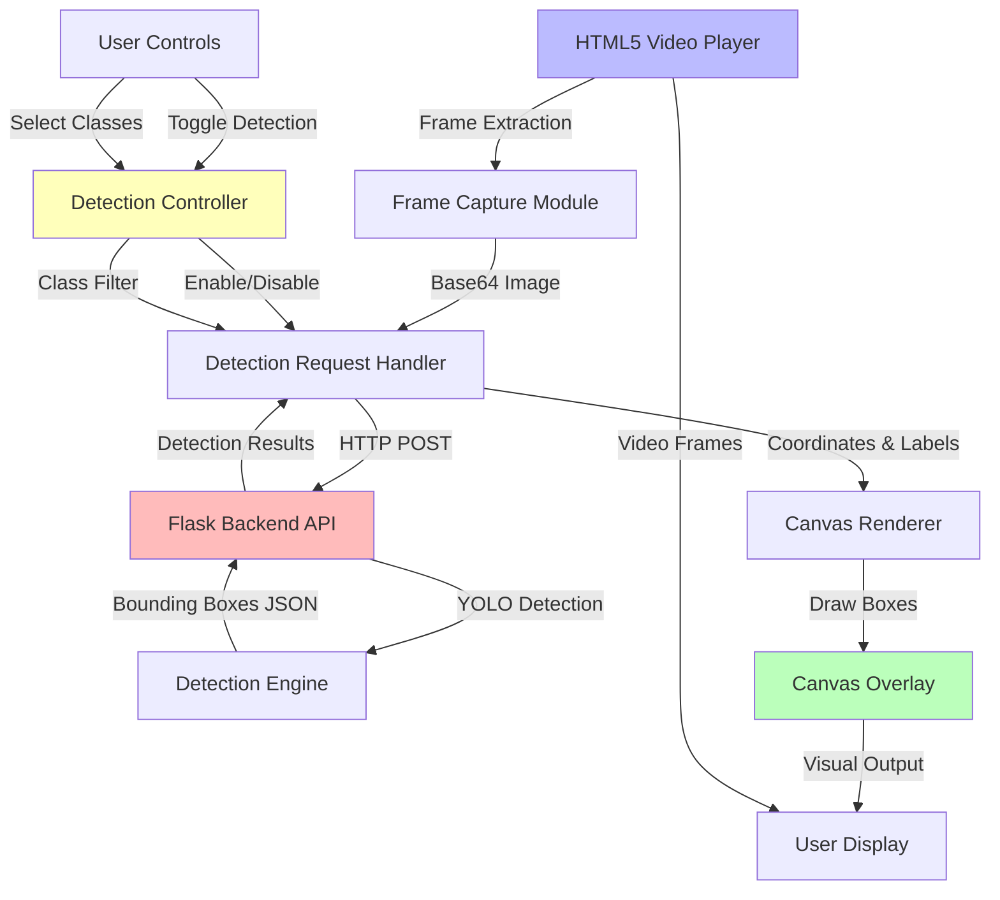

# Design Document: Real-time Video Detection

## Overview

This design implements real-time object detection during video playback by extracting frames from the HTML5 video element, sending them to a Flask backend for YOLO detection, and rendering bounding boxes on a canvas overlay. The system uses asynchronous processing to maintain smooth video playback while performing detection at a configurable frame rate.

The architecture separates concerns between frame extraction (frontend), detection processing (backend), and visualization (canvas overlay), allowing for independent optimization of each component.

## Architecture

### High-Level Architecture



### Component Interaction Flow

1. **Initialization**: Canvas overlay is created and positioned over the video element
2. **Detection Loop**: When enabled, a timer captures frames at regular intervals
3. **Frame Processing**: Current video frame is extracted to canvas and encoded as base64
4. **API Request**: Frame data and selected classes are sent to backend endpoint
5. **Detection**: Backend runs YOLO model on the frame and returns results
6. **Rendering**: Frontend draws bounding boxes on canvas overlay
7. **Synchronization**: Process repeats, skipping frames if backend is slow

## Components and Interfaces

### Frontend Components

#### 1. VideoDetectionManager
Main controller class that orchestrates real-time detection.

```javascript
class VideoDetectionManager {
    constructor(videoElement, canvasElement, statusCallback)
    
    // Control methods
    startDetection(selectedClasses)
    stopDetection()
    isDetectionActive()
    
    // Configuration
    setDetectionInterval(milliseconds)
    setSelectedClasses(classList)
    
    // Internal methods
    _captureFrame()
    _sendDetectionRequest(frameData)
    _renderResults(detections)
    _updateStatus(message, type)
}
```

#### 2. FrameCaptureModule
Handles extraction of current video frame.

```javascript
class FrameCaptureModule {
    constructor(videoElement)
    
    // Capture current frame as base64 encoded image
    captureCurrentFrame()
    
    // Get video dimensions
    getVideoDimensions()
}
```

#### 3. CanvasRenderer
Manages canvas overlay and bounding box rendering.

```javascript
class CanvasRenderer {
    constructor(canvasElement, videoElement)
    
    // Rendering methods
    clearCanvas()
    drawBoundingBox(x1, y1, x2, y2, label, confidence, color)
    drawMultipleBoxes(detections)
    
    // Canvas management
    resizeCanvas()
    getScaleFactor()
}
```

#### 4. DetectionAPIClient
Handles communication with backend detection endpoint.

```javascript
class DetectionAPIClient {
    constructor(apiEndpoint)
    
    // API methods
    async detectFrame(frameData, selectedClasses)
    
    // Error handling
    handleError(error)
}
```

### Backend Components

#### 1. Frame Detection Endpoint
New Flask route for single-frame detection.

```python
@app.route('/detect_frame', methods=['POST'])
def detect_frame():
    """
    Accepts: {
        'frame': 'base64_encoded_image',
        'selected_classes': ['person', 'car', ...]
    }
    
    Returns: {
        'detections': [
            {
                'class': 'person',
                'confidence': 0.95,
                'bbox': [x1, y1, x2, y2]
            },
            ...
        ],
        'frame_width': 1920,
        'frame_height': 1080
    }
    """
```

#### 2. Frame Decoder
Converts base64 image data to OpenCV format.

```python
class FrameDecoder:
    @staticmethod
    def decode_base64_frame(base64_string):
        """Decode base64 string to numpy array"""
        
    @staticmethod
    def validate_frame(frame):
        """Ensure frame is valid for detection"""
```

#### 3. Detection Filter
Filters YOLO results based on selected classes.

```python
class DetectionFilter:
    @staticmethod
    def filter_by_classes(detections, selected_classes):
        """Return only detections matching selected classes"""
        
    @staticmethod
    def format_detection_result(box, class_name, confidence):
        """Format detection as JSON-serializable dict"""
```

## Data Models

### Detection Request
```typescript
interface DetectionRequest {
    frame: string;              // Base64 encoded image
    selected_classes: string[]; // List of class names to detect
}
```

### Detection Response
```typescript
interface DetectionResponse {
    detections: Detection[];
    frame_width: number;
    frame_height: number;
    processing_time?: number;
}

interface Detection {
    class: string;
    confidence: number;
    bbox: [number, number, number, number]; // [x1, y1, x2, y2]
}
```

### Detection Status
```typescript
interface DetectionStatus {
    active: boolean;
    processing: boolean;
    frame_count: number;
    detection_count: number;
    error?: string;
}
```

## Correctness Properties

*A property is a characteristic or behavior that should hold true across all valid executions of a system-essentially, a formal statement about what the system should do. Properties serve as the bridge between human-readable specifications and machine-verifiable correctness guarantees.*

### Property 1: Frame capture produces valid image data
*For any* video frame captured while the video is playing, the encoded image data should be a valid base64 string that can be decoded to a valid image format.
**Validates: Requirements 5.1, 5.2**

### Property 2: Canvas dimensions match video display
*For any* video element dimensions, the canvas overlay should have identical width and height to ensure proper alignment of bounding boxes.
**Validates: Requirements 6.1, 6.2**

### Property 3: Bounding box coordinates scale correctly
*For any* detection result with bounding box coordinates, when the video display size differs from the original frame size, the rendered bounding box coordinates should be scaled proportionally to match the display.
**Validates: Requirements 3.5**

### Property 4: Detection results contain only selected classes
*For any* detection request with a non-empty selected classes list, all returned detections should have class names that exist in the selected classes list.
**Validates: Requirements 8.4**

### Property 5: Canvas clears before rendering new frame
*For any* two consecutive frames with different detection results, the canvas should not contain bounding boxes from the previous frame after rendering the new frame.
**Validates: Requirements 6.3**

### Property 6: Detection toggle controls processing
*For any* video playback state, when real-time detection is disabled, no detection requests should be sent to the backend, and when enabled with selected classes, detection requests should be sent at regular intervals.
**Validates: Requirements 2.1, 2.2**

### Property 7: Invalid frames are handled gracefully
*For any* detection request that fails due to invalid frame data or backend error, the system should continue processing subsequent frames without crashing.
**Validates: Requirements 5.5**

### Property 8: Bounding box count matches detection count
*For any* detection response containing N detections, exactly N bounding boxes should be rendered on the canvas.
**Validates: Requirements 3.3**

## Error Handling

### Frontend Error Scenarios

1. **Frame Capture Failure**
   - Cause: Video not loaded, video element not ready
   - Handling: Skip frame, log warning, continue with next interval
   - User Feedback: No visual change, status shows "waiting for video"

2. **Network Request Failure**
   - Cause: Backend unavailable, timeout, network error
   - Handling: Retry with exponential backoff (max 3 attempts)
   - User Feedback: Status shows "connection error", detection continues when recovered

3. **Invalid Detection Response**
   - Cause: Malformed JSON, missing fields
   - Handling: Log error, skip frame, continue processing
   - User Feedback: Status shows "invalid response", frame count not incremented

4. **Canvas Rendering Error**
   - Cause: Invalid coordinates, canvas context lost
   - Handling: Clear canvas, reinitialize if needed
   - User Feedback: Bounding boxes disappear temporarily

### Backend Error Scenarios

1. **Invalid Base64 Data**
   - Response: 400 Bad Request with error message
   - Handling: Validate base64 format before decoding

2. **Frame Decode Failure**
   - Response: 400 Bad Request with "invalid image data"
   - Handling: Try alternative decoding methods, return error if all fail

3. **YOLO Model Error**
   - Response: 500 Internal Server Error
   - Handling: Log error, return empty detections array with error flag

4. **Empty Selected Classes**
   - Response: 200 OK with empty detections array
   - Handling: Skip YOLO processing, return immediately

## Testing Strategy

### Unit Testing

The testing approach combines unit tests for specific scenarios and property-based tests for universal correctness properties.

**Frontend Unit Tests:**
- Frame capture returns base64 string for loaded video
- Canvas dimensions update when video is resized
- Detection toggle enables/disables request loop
- Status updates reflect current detection state
- Error handling for network failures

**Backend Unit Tests:**
- Base64 decoding produces valid numpy array
- Detection endpoint returns correct JSON structure
- Class filtering removes unselected classes
- Empty class list returns empty detections
- Invalid requests return appropriate error codes

### Property-Based Testing

Property-based testing will be implemented using:
- **Frontend**: fast-check (JavaScript property testing library)
- **Backend**: Hypothesis (Python property testing library)

Each property test will run a minimum of 100 iterations with randomly generated inputs.

**Frontend Property Tests:**
- Property 1: Frame capture validation (fast-check)
- Property 2: Canvas dimension matching (fast-check)
- Property 3: Coordinate scaling (fast-check)
- Property 5: Canvas clearing (fast-check)
- Property 6: Detection toggle control (fast-check)
- Property 8: Bounding box count (fast-check)

**Backend Property Tests:**
- Property 4: Class filtering (Hypothesis)
- Property 7: Error handling (Hypothesis)

Each test will be tagged with the format: `**Feature: realtime-video-detection, Property {number}: {property_text}**`

### Integration Testing

- End-to-end test: Upload video → enable detection → verify boxes appear
- Performance test: Measure detection latency and frame rate
- Stress test: Rapid class selection changes during playback
- Browser compatibility: Test on Chrome, Firefox, Safari

## Implementation Notes

### Performance Optimization

1. **Adaptive Frame Rate**: Adjust detection interval based on backend response time
2. **Request Queuing**: Cancel pending requests if new frame is ready
3. **Canvas Optimization**: Use requestAnimationFrame for smooth rendering
4. **Image Compression**: Reduce frame quality for faster transmission (JPEG quality 70-80)

### Browser Compatibility

- Use `HTMLCanvasElement.toDataURL()` for frame capture (widely supported)
- Fallback to `drawImage()` if direct video capture fails
- Test pointer-events CSS for canvas overlay interaction

### Security Considerations

- Validate base64 data length to prevent memory exhaustion
- Implement rate limiting on detection endpoint (max 30 requests/second per client)
- Sanitize class names to prevent injection attacks
- Use CORS headers appropriately for API endpoint

### Future Enhancements

- WebSocket connection for lower latency
- Client-side detection using TensorFlow.js
- Detection result caching for seeked frames
- Multi-threaded backend processing
- GPU acceleration for detection
