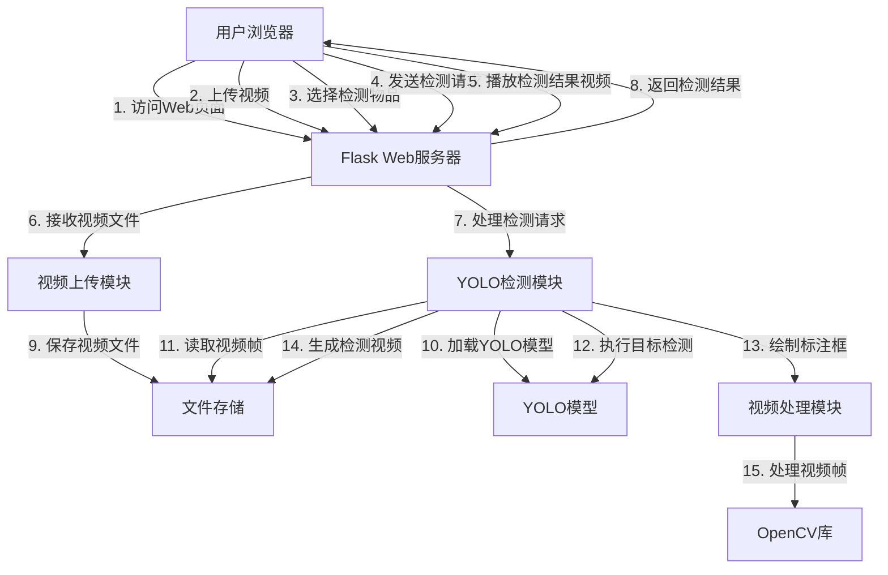

# 视频实时标记系统



## 系统架构说明

### 1. 前端层
- **用户浏览器**：提供视频上传、物品选择、视频播放等交互界面
- **技术栈**：HTML5、CSS3、JavaScript

### 2. 后端层
- **Flask Web服务器**：处理HTTP请求，提供Web服务
- **视频上传模块**：处理用户上传的视频文件，保存到服务器
- **YOLO检测模块**：加载YOLO模型执行目标检测
- **视频处理模块**：使用OpenCV处理视频帧，绘制检测标注

### 3. 核心技术组件
- **YOLO**：实现实时目标检测功能
- **OpenCV**：处理视频帧，实现图像处理
- **文件存储**：保存上传的视频和处理后的结果视频

## 数据流说明

1. 用户通过浏览器访问Web页面
2. 用户上传本地视频文件到服务器
3. 用户在页面上选择需要检测的物品类别
4. 用户点击"开始检测"按钮，发送检测请求
5. 服务器接收请求，加载YOLOV11模型
6. 读取上传的视频文件，逐帧处理
7. 对每一帧执行目标检测，只保留用户选择的物品类别
8. 在检测到的物品周围绘制标注框和类别名称
9. 返回检测结果，供前端层进行目标标注
10. 前端层在视频播放器上添加Canvas元素，用于叠加绘制检测框
11. 在Canvas上绘制绿色边界框标识检测到的物体，并显示物体类别名称和置信度
12. 检测框与视频播放实时同步

## 核心功能模块

### 1. 视频上传与管理
- 支持多种视频格式（mp4、avi、mov、mkv）
- 安全的文件上传机制
- 视频文件存储管理

### 2. 物品选择与配置
- 动态加载YOLO模型支持的所有类别
- 提供可视化的物品选择界面
- 支持全选/取消选择功能

### 3. 实时目标检测
- 基于YOLO模型的高效检测
- 支持指定类别检测
- 实时标注检测结果

### 4. 视频播放与结果展示
- 原始视频与检测结果视频对比播放
- 流畅的视频播放体验
- 清晰的标注效果展示

## YOLO模型训练模块 (LoRA微调)

### 功能概述

本系统新增了YOLO模型训练功能，支持使用LoRA (Low-Rank Adaptation) 算法对YOLO11模型进行高效微调。用户可以通过视频截图标注创建自定义训练数据集，并在本地训练自己的目标检测模型。

### 训练工作流程

1. **视频播放与截图**
   - 上传或选择已有视频
   - 播放视频并在关键帧暂停
   - 截取当前帧用于标注

2. **图像标注**
   - 在截取的帧上绘制边界框
   - 为每个边界框指定类别名称
   - 支持单帧多目标标注
   - 保存标注到本地存储

3. **标注管理**
   - 浏览所有已保存的标注图片
   - 查看标注详情（边界框、类别）
   - 删除不需要的标注
   - 选择标注用于生成数据集

4. **数据集生成**
   - 选择要包含的标注图片
   - 配置训练/验证/测试集比例
   - 自动生成YOLO格式数据集
   - 生成dataset.yaml配置文件

5. **模型训练**
   - 选择基础模型（yolo11n, yolov8n等）
   - 配置训练参数（epochs, batch_size, learning_rate）
   - 配置LoRA参数（rank, alpha, dropout）
   - 后台执行训练任务
   - 实时监控训练进度

6. **模型下载**
   - 训练完成后下载模型文件
   - 包含训练元数据（参数、指标）
   - 可直接用于目标检测

### 访问训练页面

在主页面点击右上角的"🎯 模型训练"按钮，或直接访问 `/training` 路由。

### LoRA参数说明

| 参数 | 默认值 | 说明 |
|------|--------|------|
| LoRA Rank | 8 | 低秩矩阵的秩，越大模型容量越大 |
| LoRA Alpha | 16 | 缩放因子，通常设为rank的2倍 |
| LoRA Dropout | 0.1 | Dropout比率，防止过拟合 |

### 训练参数说明

| 参数 | 默认值 | 说明 |
|------|--------|------|
| Epochs | 50 | 训练轮数 |
| Batch Size | 16 | 批次大小 |
| Learning Rate | 0.001 | 学习率 |
| Image Size | 640 | 输入图像尺寸 |

### 目录结构

```
static/training/
├── annotations/     # 标注数据存储
│   └── {id}.json   # 标注JSON文件
├── datasets/        # 生成的数据集
│   └── {name}/
│       ├── train/images/
│       ├── train/labels/
│       ├── val/images/
│       ├── val/labels/
│       ├── test/images/
│       ├── test/labels/
│       └── dataset.yaml
└── models/          # 训练输出模型
    └── {task_id}/
        ├── best.pt
        └── metadata.json
```

### API端点

| 端点 | 方法 | 说明 |
|------|------|------|
| `/training` | GET | 训练页面 |
| `/training/capture_frame` | POST | 截取视频帧 |
| `/training/annotations` | GET/POST | 标注列表/保存标注 |
| `/training/annotations/{id}` | GET/DELETE | 获取/删除标注 |
| `/training/annotations/validate` | POST | 验证标注 |
| `/training/dataset/generate` | POST | 生成数据集 |
| `/training/datasets` | GET | 数据集列表 |
| `/training/start` | POST | 开始训练 |
| `/training/progress/{id}` | GET | 训练进度 |
| `/training/cancel/{id}` | POST | 取消训练 |
| `/training/models` | GET | 已训练模型列表 |
| `/training/download/{id}` | GET | 下载模型 |
