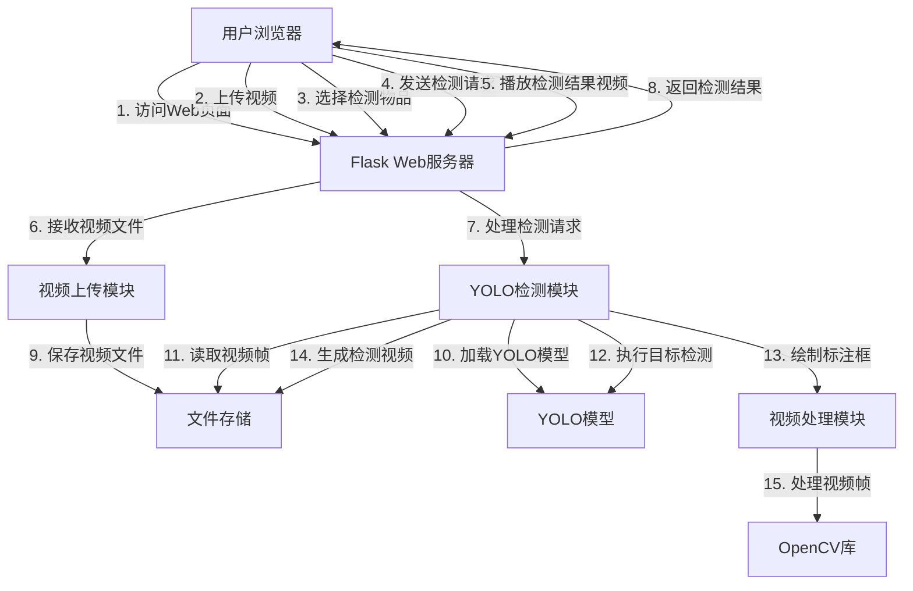

# 视频实时标记系统

## 系统架构说明

### 1. 前端层
- **用户浏览器**：提供视频上传、物品选择、视频播放等交互界面
- **技术栈**：HTML5、CSS3、JavaScript

### 2. 后端层
- **Flask Web服务器**：处理HTTP请求，提供Web服务
- **视频上传模块**：处理用户上传的视频文件，保存到服务器
- **YOLO检测模块**：加载YOLO模型执行目标检测
- **视频处理模块**：使用OpenCV处理视频帧，绘制检测标注

### 3. 核心技术组件
- **YOLO**：实现实时目标检测功能
- **OpenCV**：处理视频帧，实现图像处理
- **文件存储**：保存上传的视频和处理后的结果视频

## 数据流说明

1. 用户通过浏览器访问Web页面
2. 用户上传本地视频文件到服务器
3. 用户在页面上选择需要检测的物品类别
4. 用户点击"开始检测"按钮，发送检测请求
5. 服务器接收请求，加载YOLOV11模型
6. 读取上传的视频文件，逐帧处理
7. 对每一帧执行目标检测，只保留用户选择的物品类别
8. 在检测到的物品周围绘制标注框和类别名称
9. 返回检测结果，供前端层进行目标标注
10. 前端层在视频播放器上添加Canvas元素，用于叠加绘制检测框
11. 在Canvas上绘制绿色边界框标识检测到的物体，并显示物体类别名称和置信度
12. 检测框与视频播放实时同步

## 核心功能模块

### 1. 视频上传与管理
- 支持多种视频格式（mp4、avi、mov、mkv）
- 安全的文件上传机制
- 视频文件存储管理

### 2. 物品选择与配置
- 动态加载YOLO模型支持的所有类别
- 提供可视化的物品选择界面
- 支持全选/取消选择功能

### 3. 实时目标检测
- 基于YOLO26模型的高效检测
- 支持指定类别检测
- 实时标注检测结果

### 4. 视频播放与结果展示
- 原始视频与检测结果视频对比播放
- 流畅的视频播放体验
- 清晰的标注效果展示
